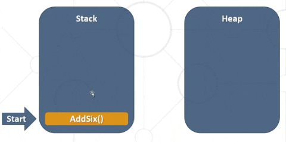
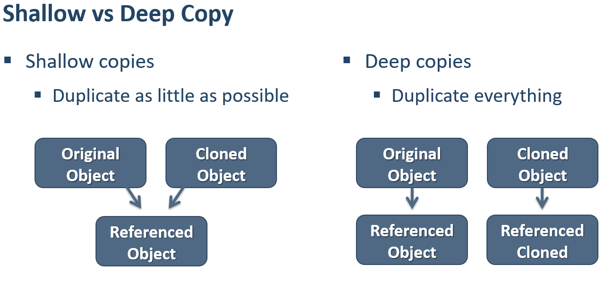

C# Advance Masterclass 
**Chapter 1 - C# In Dept**
___

##### Table of Contents  

* [C#](#CSharpIntro) 
* [Stack and Heap](#StackAndHeap) 
* [CLR and FCL](#CLR) 
* [Intermediate Language](#ImLang) 
* [Memory Management](#2) 
* [Garbage Collector in .NET](#head3ers) 
* [Working with unmanaged C++ code](#4) 
* [Further Reading](#literature) 

Is representing the contents in this chapter.
<a name="CSharpIntro"/></a>
## Introduction

When starting something new, it is always best to start from the root. So let's talk about the beginnings of C#.

<table style="width:100%">
  <tr>
    <td style="border: 1px solid #000;">
		<ul>
			<li>Developed by Anders Hejlsberg in 2000</li>
			<li>Originally called Cool ("C-Like object oriented language")</li>
			<li>Part of the CLR</li>
			<li>C# is Microsoft's trademark name for ECMA-334</li>
		</ul>
	</td>
  </tr>
   <tr>
    <td style="border: 1px solid #000;">
		<ul>
			<li>ECMA stands for European Computer Manufacturers Association design goals for C# were: 
				<ul>
					<li>Simple, Modern, General Purpose and Object Oriented language</li>
				</ul>
			</li>
			<li>They wanted the language to provide support for software engineering principles such as:</li>
				<ul>
					<li>Type and Array bounce checking, detection of a uninitialized variables and garbage collection</li>
				</ul>
			<li>Robustness, Durability and Programmer productivity were very important points</li>
		</ul>
	</td>
  </tr>
 </table>

As you can see the language is relatively new, however that does not stop it from being in the top 5 most popular programming languages. 
Not only that approximately 31% of all developers using it regularly. It is also the 3rd largest community on StackOverflow with more than 1.1 million topics.
<a name="StackAndHeap"/></a>
## Memory Management 101 - Stack and Heap

Let us start with the basics. When we talk about memory we need to talk about the different types that we can store.
That is **Value type** and **Reference type**. 

Most of you know the differences:

Value type are derived from System.ValueType and can be int , bool , char , enum and any struct. 
They can be allocated on the heap or on the stack, depending on where they were declared. If the value type was declared as a variable inside a method then it's stored on the stack

Reference type are derived from System.Object and can be Class, Interface, delegate, object, string. 
It is used by a reference which hold a reference to the object but not the object itself, which means that in the Stack on runtime time we only have the reference.

Now there is also a type, which if you just took C# as an Introduction to OOP, is not higly mentioned is **Pointer**. 
In computer science, a pointer is a programming language object that stores the memory address of another value located in computer memory
The reason is that Pointers are not often mentioned in C# is because they are low-level, while C# is constructed as a High-level language.
This means that Pointers are abstracted by the language (hidden), and they are considered "unsafe" to use.

We have two types of memory Stack and Heap
#### What is Stack
It is stored in computer RAM. It is much faster to allocate in comparison to variables on the Heap. 
We can have a stack overflow when too much of the stack is used. 
Data created on the stack can be used without pointers and usually has a maximum size already determined when your program start.
#### What is Heap
It is stored in computer RAM. It is slower to allocate in comparison to variables on the stack. 
Used on demand to allocate a block of data for use by the program. 
Can have allocation failures if too big of a buffer is requested to be allocated.
Usually memory leaks occurs here.

```csharp
class Program
    {
        public class MyReferenceType
        {
            public int MyValueType;
        }
        public static MyReferenceType AddSix(int valueToIncrease)
        {
            MyReferenceType result = new MyReferenceType();
            result.MyValueType = valueToIncrease + 6;
            return result;
        }

        static void Main(string[] args)
        {
            MyReferenceType myReferenceTypeWithIncreasedNumber = AddSix(6);
            System.Console.WriteLine(myReferenceTypeWithIncreasedNumber.MyValueType);
        }
    }
```
**Output:**
```
12
```
This code above would interact with the memory as follows:


#### Parameter passing in C#
As you can see from the example above it is common to pass Parameters of different types to a Function. 

By default, parameters are value parameters. This means that a new storage location in the Stack is created for the variable in the function member declaration, and it starts off with the value that you specify in the function member invocation.

This is not an issue, however if you have a recursive method that passes big Values every time, this would undoubtedly lead to Stack Overflow.
Let us demonstrate.

```csharp
 class Program
    {
        public struct MyStruct
        {
            public double a, b, c, d, e, f, g, h;
        }

        public static void ComputeOnMyStruct(MyStruct pValue)
        {
            ComputeOnMyStruct(pValue);
        }

        static void Main(string[] args)
        {
             MyStruct x = new MyStruct(){
                a = 21121212.2112,
                b = 21121212.2112,
                c = 21121212.2112,
                d = 21121212.2112,
                e = 21121212.2112,
                f = 21121212.2112,
                g = 21121212.2112,
                h = 21121212.2112,
            };
            ComputeOnMyStruct(x);
        }
    }
```
**Output:**
```
Stack Overflow
```

Now considering we are calling ComputeOnMyStruct recursively and without a break condition the out is not a big surprise. 
However it is possible even if you have a break condition, to get this exception, because every parameter by default is value type.

An different error that you may encounter:

```csharp
   class Program
    {
        static void RemoveWord(string x)
        {
            x = null;
        }
        static void Main(string[] args)
        {
            string word = "Hello World";
            RemoveWord(word);
            System.Console.WriteLine(word);
        }
    }
```
**Output:**
```
Hello World
```
But you set the "word" to null how is it possible that you still print "Hello world"?

So how do we escape this common pitfalls? **Reference parameters**.

Reference parameters don't pass the values of the variables used in the function member invocation - they use the variables themselves.
In C# this is achieved via using the **ref** keyword. 
Basically, it means that any change made to a value that is passed by reference will reflect this change since you are modifying the value at the address and not just the value. 

```csharp
   class Program
    {
        static void RemoveWord(ref string x)
        {
            x = null;
        }
        static void Main(string[] args)
        {
            string word = "Hello World";
            RemoveWord(ref word);
            System.Console.WriteLine(word);
        }
    }
```
**Output:**
```

```


#### Shallow and Deep Copy



Sometimes we have to copy one variable to another, using the assignment operator, this is often to do some specific calculation on the values and then compare with the original.

The most common pitfall comes when there is a ReferenceType, containg another ReferenceType and an ValueType.

If the original variable is of ValueType things function as expected, however when we do that with Reference types in C# what happens is that both instances share the same memory address. 
We get this behavior using the MemberwiseClone() method that is defined in the super class called System.Object. 
This is called a **Shallow Copy**.

The end result in this is modification of the reference type inside of the copied reference type, changes the original data from which we created the copy.

In order to mitigate this issue we need to perform a **Deep copy** 
Deep copy is creating a new object and then copying the nonstatic fields of the current object to the new object. 
If a field is a value type a bit-by-bit copy of the field is performed. 
If a field is a reference type a new copy of the referred object is performed. This is standartly done by using the [ICloneable interface](https://docs.microsoft.com/en-us/dotnet/api/system.icloneable?redirectedfrom=MSDN&view=netcore-3.0).


<a name="CLR"/></a>
## CLR and FCL
ClR and FCL are abbreviations for Common Language Runtime and Framework Class Library, which are the two main components of .NET. 
.NET on the other side is a software framework used for building apps for web, windows, mobile, windows server, and Microsoft Azure.

<a name="literature"/></a>
## Further Reading
* [Short introduction References and Values by John Skeet]( https://jonskeet.uk/csharp/references.html )
* [Object Copying](https://en.wikipedia.org/wiki/Object_copying#Shallow_copy)
* [Deep cloning objects](https://stackoverflow.com/questions/78536/deep-cloning-objects)


